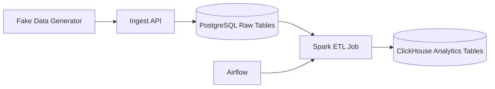

# ETL Pipeline with Minikube

[](https://opensource.org/licenses/MIT)

```
batch-etl/                  # repo root (git repo name)
├── src/                            # ← all importable/production code
│   └── batch_etl/                  # or github_jobs_etl, finance_pipeline, etc. — pick a short, descriptive package name
│       ├── __init__.py
│       ├── __main__.py             # optional: python -m sales_etl → runs default flow
│       ├── config/                 # pydantic settings, yaml schemas
│       │   ├── settings.py
│       │   └── schemas/
│       ├── extract/                # connectors (api, s3, postgres, kafka, etc.)
│       ├── transform/              # core business logic, spark/pandas/dbt-like funcs
│       ├── load/                   # writers, upsert logic, validation
│       ├── utils/                  # logging, retries, metrics, date helpers
│       ├── flows/                  # if using Prefect/Dagster/Airflow → flow definitions here
│       └── entrypoints/            # CLI commands or main scripts (e.g. main.py, run_daily.py)
├── tests/                          # pytest suite — mirrors src/ structure
│   ├── unit/
│   ├── integration/
│   └── conftest.py
├── config/                         # runtime configs (not committed secrets)
│   ├── dev.yaml
│   ├── prod.yaml                   # or use secrets / env vars in k8s
│   └── base.yaml
├── minikube/                     # ← Minikube / K8s manifests (very portfolio-friendly)
│   ├── deployment.yaml             # your main Job / CronJob
│   ├── configmap.yaml              # non-secret config
│   ├── secret.yaml                 # example (gitignored) or use sealed-secrets
│   ├── cronjob.yaml                # if scheduled
│   └── serviceaccount.yaml         # if needed for RBAC
├── .dockerignore                   # critical: exclude tests/, .git/, __pycache__ etc.
├── Dockerfile                      # single- or multi-stage
├── pyproject.toml                  # uv + build-system = hatch/setuptools/PDM
├── uv.lock                         # exact deps
├── README.md                       # how to run locally, in docker, in minikube
├── .gitignore
└── Makefile                        # optional: make build, make test, make minikube-up, etc.
```


## Description

This project implements an ETL (Extract, Transform, Load) pipeline for processing orders. It simulates data ingestion from an external system, stores raw data in a Postgres OLTP database, transforms it via an ETL script, and loads it into a warehouse schema.

I built this project to demonstrate core data engineering concepts end-to-end: ingestion, orchestration, transformation, analytical serving, and deployment. The tools are interchangeable to some extent; I deliberately chose widely used modern data tools to get hands-on experience with technologies commonly used in production pipelines, and then I designed the project so each tool had a real role. However, the important part is understanding workload separation, reliability, and the data flow that this project demonstrates.

### Architecture Overview


The pipeline flows as follows:

- **Generator**: Acts as an external system that generates order data.
- **POST /orders**: Endpoint for sending data to the ingestion service.
- **Ingest API Service**: Receives data via API and inserts it into the database.
- **Postgres (OLTP Raw Tables)**: Stores raw ingested data.
- **ETL Script**: Transforms data from raw tables.
- **Warehouse Schema**: Final destination for transformed data.

All components are deployed in a Minikube Kubernetes cluster using Docker containers.

## Prerequisites

- **Docker**: For building and running containers. Install from [official docs](https://docs.docker.com/get-docker/).
- **Minikube**: For local Kubernetes cluster. Install from [official guide](https://minikube.sigs.k8s.io/docs/start/). Recommended: Use the Docker driver.
- **kubectl**: Kubernetes CLI (usually installed with Minikube).
- **Python** (if your ETL script or services use it): Version 3.8+.
- **Postgres Client** (optional): For querying the DB, e.g., `psql`.
- Hardware: At least 4GB RAM and 2 CPUs for Minikube.

Ensure your system meets Minikube's requirements (e.g., virtualization enabled in BIOS for VM drivers).

## Installation

1. **Clone the Repository**:
```
git clone https://github.com/yourusername/etl-pipeline.git
cd etl-pipeline
```


2. **Install Docker and Minikube** (if not already installed):
- Docker: Follow [installation instructions](https://docs.docker.com/get-docker/).
- Minikube: 
```
curl -LO https://storage.googleapis.com/minikube/releases/latest/minikube-linux-amd64  # Adjust for your OS
sudo install minikube-linux-amd64 /usr/local/bin/minikube
minikube start --driver=docker
text
```


3. **Build Docker Images**:
- Build images for the Generator, Ingest API, ETL Script, etc.


4. **Start Minikube and Deploy**:
```
minikube start
kubectl apply -f k8s/postgres-deployment.yaml  # Deploys Postgres
kubectl apply -f k8s/ingest-api-deployment.yaml
kubectl apply -f k8s/etl-job.yaml  # For the ETL script as a Kubernetes Job
```


5. **Set Up Database**:
- Port-forward to access Postgres:
```
kubectl port-forward svc/postgres 5432:5432
```

- Create database and user:
```
psql -h localhost -U user -d dbname -f sql/init-raw-tables.sql
psql -h localhost -U user -d dbname -f sql/init-warehouse-schema.sql
```


## Usage

1. **Run the Generator**:
   - Simulate data ingestion:
   ```
   python generator.py --endpoint http://ingest-api-service:8080/orders
   ```


2. **Ingest Data**:
- The Ingest API should be running in Minikube. Port-forward to test locally:
```
kubectl port-forward svc/ingest-api 8080:8080
curl -X POST http://localhost:8080/orders -d '{"order_id": 1, "item": "widget"}'
```


3. **Run ETL Script**:
- Trigger the ETL job:
```
kubectl apply -f k8s/etl-job.yaml
```


4. **Query the Warehouse**:
- Port-forward Postgres and query:
```
psql -h localhost -U user -d dbname -c "SELECT * FROM warehouse.orders_transformed;"
```


5. **Monitoring**:
- Check pod status: `kubectl get pods`
- Logs: `kubectl logs <pod-name>`


## Configuration

- Edit `.env` for variables like `DB_HOST`, `DB_USER`, `DB_PASSWORD`.
- Kubernetes secrets for sensitive data: See `k8s/secrets.yaml`.


## Deployment

## Results


## Troubleshooting

- **Minikube not starting**: Ensure Docker is running and virtualization is enabled.
- **Pod crashes**: Check logs with `kubectl logs <pod-name>`.
- **Connection refused**: Verify services are exposed and port-forwarded correctly.
- **Out of memory**: Increase Minikube resources: `minikube start --memory=4096 --cpus=2`.


## Design Decisions, Rationale, and Trade-offs

1. **Why Decorators for Logging?**
- Decorators provide a clean, reusable way to add logging to functions.
- They allow for easy modification of logging behavior without changing the function's core logic.
- They can be easily extended to include additional logging features, such as metrics or tracing.

2. **Classes vs. Simple Functions**
- In some cases, classes may be more appropriate than simple functions, as they provide a way to group related functionality and data.
- In other cases, simple functions may be more appropriate, as they are often easier to read and understand.
- To leverage dependency injection (e.g., passing a DB session) and maintain state across multi-step processes, making the code more testable with mocks.
- Transforms are also multi-layered (BaseTransformer, CustomTransformer, etc.) so inheritance is a better fit than composition.

3. **Why Minikube?**
- Having previously deployed projects in Kubernetes environments, I chose Minikube to reinforce my knowledge of Kubernetes and to provide a cleaner deployment process for development and testing. This project serves as a sandbox to refine my knowledge of K8s networking, resource limits, and automated scheduling-—essential skills for modern Data Engineering.
- The real benefit is, using K8s manifests (Deployments, CronJobs, ConfigMaps) allows for a cleaner, more declarative deployment process compared to basic container orchestration.

4. **Resource Limits**
- Setting resource limits is crucial for ensuring the stability and performance of the pipeline. It prevents any single component from consuming excessive resources, which could impact other components or the overall system. 
- In the kubernetes manifests, you may notice that I have set resource limits for each component. This is to ensure that the pipeline is stable and performant. Estimated memory usage for each component is as follows:
    - Postgres: 256-512 MB
    - ETL Script: 128-256 MB
    - ClickHouse: 512-1024 MB

5. **Why Spark?**
- The amount of data generated will not be able to mimic real world load as I have not had the opportunity to deploy this in another server other than my personal computer, however I chose Spark as if I had to scale this project to production.  
- I also kept transformations in Spark’s native execution path as much as possible to avoid unnecessary Python-side overhead.

6. **Why time-based CDC?**
- I chose time-based CDC as it is a simple and efficient way to capture changes in the database. The design still allows for batch incremental processing, therefore I opted out of using a CDC tool like Debezium. 
- Please refer to my streaming pipeline for Debezium usage.

7. **How did I ensure data quality and integrity?**
- I used Spark's schema inference to ensure that the data is properly typed. I also used Spark's built-in data quality checks to ensure that the data is properly formatted. 
- Additionally, I used Spark's built-in data integrity checks to ensure that the data is properly validated. 
- I also implemented a soft delete mechanism, using ClickHouse's ReplacingMergeTree engine with version column "update_timestamp". This ensures eventual deduplication and eventual consistency. 
- At query time, it is strongly recommended to either use ```SELECT...FROM database.table_name FINAL``` (with additional filters as you please), or use ```SELECT argMax(column_name, "update_timestamp")``` for the non-primary or non-composite key columns. This is to ensure that the data selected is properly deduplicated.

## License

MIT License. See [LICENSE](LICENSE) for details.


